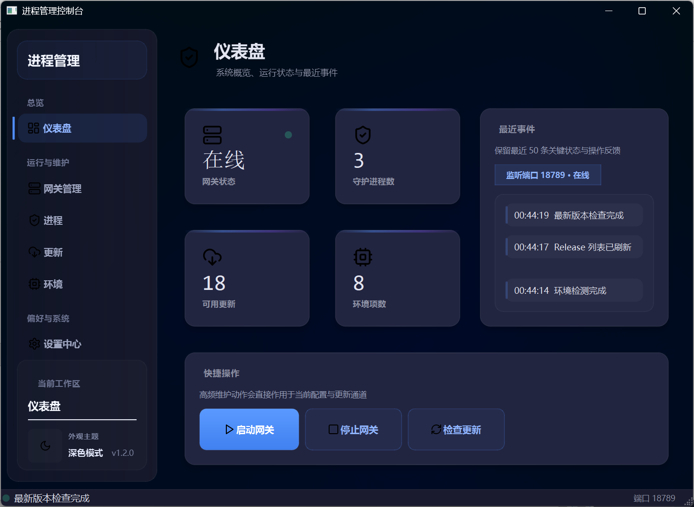
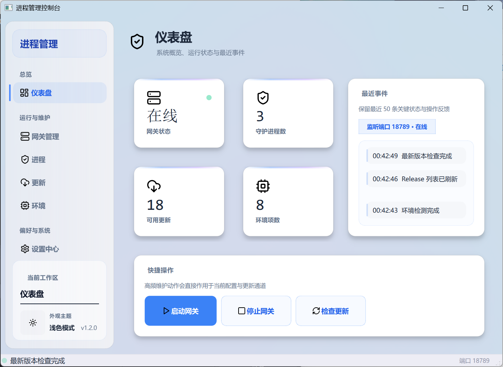

# 进程管理控制台

> OpenClaw 网关守护与系统环境管理桌面工具

<div align="center">


</div>

## 功能特性

### 仪表盘
- 网关状态实时监控（在线/离线 + 端口）
- 环境概览（Node.js / Python / Git / .NET / PowerShell / CMake / Java）
- 快捷操作：一键启动/重启网关、环境检测

### 网关管理
- 内置 `openclaw gateway start/stop/restart` 命令
- TCP 端口存活检测
- 崩溃自动拉起 + CPU/内存智能阈值守护

### 更新管理
- 通过 `npm install -g openclaw@latest` 执行更新
- 支持 stable / beta 通道切换
- GitHub Releases 列表浏览与下载
- 当前版本、通道、安装方式状态展示

### 环境检测
- 自动扫描 8 种开发工具链
- 对比当前版本与最新版本
- 一键更新（winget / npm）

### 其他
- Windows 11 Mica / Acrylic 毛玻璃特效
- 深色 / 浅色 / 跟随系统主题
- DPI 缩放自适应
- 系统托盘常驻 + 开机自启

## 技术栈

| 层 | 技术 |
|---|---|
| UI 框架 | Qt 6.11.1 Widgets |
| 语言 | C++17 |
| 构建 | CMake + Ninja |
| 编译器 | Clang 17 (LLVM MinGW) |
| DWM 特效 | Windows DWM API (Mica / Acrylic) |
| GPU 渲染 | OpenGL (QSurfaceFormat) |

## 构建

### 环境要求

- **Qt** 6.8+ (推荐 6.11.1)
- **编译器** LLVM MinGW 17+ 或 MSVC 2022
- **CMake** 3.20+
- **Ninja** 1.10+

### 编译步骤

```bash
# Debug
mkdir build-debug && cd build-debug
cmake .. -G Ninja -DCMAKE_BUILD_TYPE=Debug -DCMAKE_PREFIX_PATH="D:/Qt/6.11.1/llvm-mingw_64" -DCMAKE_CXX_COMPILER="D:/Qt/Tools/llvm-mingw1706_64/bin/clang++.exe"
ninja

# Release
mkdir build-release && cd build-release
cmake .. -G Ninja -DCMAKE_BUILD_TYPE=Release -DCMAKE_PREFIX_PATH="D:/Qt/6.11.1/llvm-mingw_64" -DCMAKE_CXX_COMPILER="D:/Qt/Tools/llvm-mingw1706_64/bin/clang++.exe"
ninja
```

### 部署运行时 DLL

```bash
cd build-release
windeployqt6.exe --no-translations OpenclawGuard.exe
```

## 项目结构

```
OpenclawGuard/
├── src/
│   ├── main.cpp              # 入口 + OpenGL 初始化 + DPI 设置
│   ├── mainwindow.cpp/h      # 主窗口（6 页面布局）
│   ├── gatewaymanager.cpp/h  # 网关管理（openclaw gateway 命令）
│   ├── processguard.cpp/h    # 进程守护（自动拉起 + 阈值检测）
│   ├── updatemanager.cpp/h   # 更新管理（npm + GitHub API）
│   ├── envmanager.cpp/h      # 环境检测（异步更新）
│   ├── portmonitor.cpp/h     # TCP 端口监控
│   ├── theme.cpp/h           # 主题系统 + DWM 特效
│   ├── mica_helper.cpp       # Windows Mica/Acrylic 实现
│   ├── traymanager.cpp/h     # 系统托盘
│   ├── settings.cpp/h        # 配置持久化
│   ├── config.h              # 常量定义
│   ├── toggle_switch.cpp/h   # 自定义开关控件
│   └── backend.cpp/h         # 后端工具类
├── resources/                # SVG 图标 + 资源文件
├── CMakeLists.txt
├── .gitignore
├── LICENSE
└── README.md
```

## 截图

<div align="center">

| 深色主题 | 浅色主题 |
|:---:|:---:|
|  |  |

</div>

## 许可证

[MIT License](LICENSE)

---

<div align="center">

**进程管理控制台** — 旺老板的 OpenClaw 管理利器 🛠️

</div>
